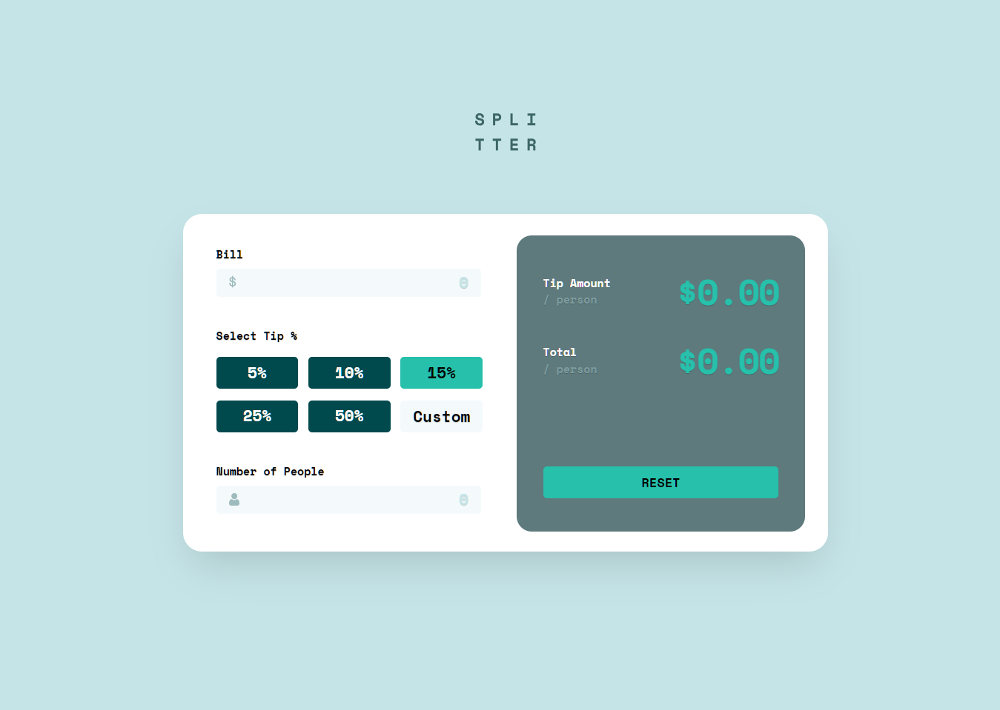

# Frontend Mentor - Tip calculator app solution

This is a solution to the [Tip calculator app challenge on Frontend Mentor](https://www.frontendmentor.io/challenges/tip-calculator-app-ugJNGbJUX). Frontend Mentor challenges help you improve your coding skills by building realistic projects.

## Table of contents

- [Overview](#overview)
  - [The challenge](#the-challenge)
  - [Screenshot](#screenshot)
  - [Links](#links)
- [My process](#my-process)
  - [Built with](#built-with)
  - [What I learned](#what-i-learned)
  - [Continued development](#continued-development)
  - [Useful resources](#useful-resources)
  - [AI Collaboration](#ai-collaboration)
- [Author](#author)
- [Acknowledgments](#acknowledgments)

## Overview

### The challenge

Users should be able to:

- View the optimal layout for the app depending on their device's screen size
- See hover states for all interactive elements on the page
- Calculate the correct tip and total cost of the bill per person

### Screenshot



### Links

- Solution URL: [https://github.com/ParthaDey5/tip-calculator-app-main]
- Live Site URL: [Add live site URL here]

## My process

### Built with

- Semantic HTML5 markup
- CSS custom properties
- Tailwind CSS
- Mobile-first workflow
- BEM CSS methodology
- JavaScript (ES6+)
- Responsive design

### What I learned

This project was a great opportunity to practice several key concepts:

**CSS Architecture:**
- Implemented BEM (Block Element Modifier) methodology for clean, maintainable CSS
- Separated concerns by moving all Tailwind utility classes from HTML to CSS file
- Organized CSS into logical components for better maintainability

**JavaScript Functionality:**
- Built dynamic tip calculation with real-time updates
- Implemented form validation for edge cases (division by zero, invalid inputs)
- Handled custom tip input alongside preset percentage buttons
- Used event listeners for seamless user interaction

**Responsive Design:**
- Created mobile-first responsive layouts using Tailwind CSS
- Implemented proper spacing and sizing for different screen sizes
- Ensured consistent user experience across devices

**Code Examples:**

```javascript
// Dynamic calculation with validation
function calculate() {
  const bill = parseFloat(elements.billInput.value) || 0;
  const peopleValue = elements.peopleInput.value;
  const people = parseFloat(peopleValue) || 0;

  // Validate input before calculation
  if (peopleValue === "" || parseFloat(peopleValue) <= 0) {
    elements.errorPeople.classList.remove("hidden");
    return;
  }
  elements.errorPeople.classList.add("hidden");

  const tipAmount = (bill * selectedTipPercent) / people;
  const totalAmount = (bill * (1 + selectedTipPercent)) / people;

  // Handle edge cases
  elements.tipAmount.textContent = !isFinite(tipAmount)
    ? "$0.00"
    : `$${tipAmount.toFixed(2)}`;
  elements.totalAmount.textContent = !isFinite(totalAmount)
    ? "$0.00"
    : `$${totalAmount.toFixed(2)}`;
}
```

```css
/* Organized component-based CSS */
.Tip-calculator__section__main {
    @apply lg:w-[51rem] w-full aspect-[1440/755] lg:row-x-between lg:row-y-start col-x-center lg:rounded-[1.5rem] rounded-[6rem] lg:mt-[5rem] mt-[9rem] lg:pl-[2.6rem] lg:pr-[1.8rem] px-[5rem] bg-[var(--color-White)] shadow-5xl;
}
```

### Continued development

Areas I want to focus on in future projects:

- **Advanced CSS Techniques:** Explore more complex animations and transitions
- **JavaScript Patterns:** Implement more sophisticated state management patterns
- **Accessibility:** Deepen understanding of ARIA attributes and keyboard navigation
- **Performance:** Optimize CSS and JavaScript for better loading times
- **Testing:** Add unit tests for JavaScript functionality

### Useful resources

- [MDN Web Docs](https://developer.mozilla.org/) - Comprehensive documentation for web technologies
- [CSS-Tricks](https://css-tricks.com/) - Excellent articles on CSS techniques and best practices
- [Tailwind CSS Documentation](https://tailwindcss.com/docs) - Detailed guide for utility-first CSS framework
- [Frontend Mentor Community](https://www.frontendmentor.io/community) - Great place to get feedback and learn from others

### AI Collaboration

I worked with AI coding assistants during this project to enhance my learning experience:

**Tools Used:**
- Claude AI for code review and debugging assistance
- AI pair programming for problem-solving and concept exploration

**How AI Helped:**
- **Debugging:** AI helped identify issues with CSS variable naming conventions (double dashes vs single dashes)
- **Code Organization:** Guided me in implementing proper separation of concerns between HTML and CSS
- **Best Practices:** Provided guidance on BEM methodology and CSS architecture
- **Problem Solving:** Assisted with JavaScript edge cases like handling `NaN` and `Infinity` values

**What Worked Well:**
- AI provided excellent explanations for concepts I was struggling with
- Helped me think through problems rather than just giving solutions
- Offered multiple approaches and explained the trade-offs

**Challenges:**
- Had to be specific about what I wanted to learn vs. what I wanted automated
- Needed to verify AI suggestions against best practices and project requirements

## Author

- Website - [Add your name here](https://www.your-site.com)
- Frontend Mentor - [@yourusername](https://www.frontendmentor.io/profile/yourusername)
- Twitter - [@yourusername](https://www.twitter.com/yourusername)

## Acknowledgments

This is where you can give a hat tip to anyone who helped you out on this project. Perhaps you worked in a team or got some inspiration from someone else's solution. This is the perfect place to give them some credit.

**Thank you to:**
- Frontend Mentor for providing this excellent learning opportunity
- The Frontend Mentor community for inspiration and feedback
- Anyone who reviewed my code and provided helpful suggestions
